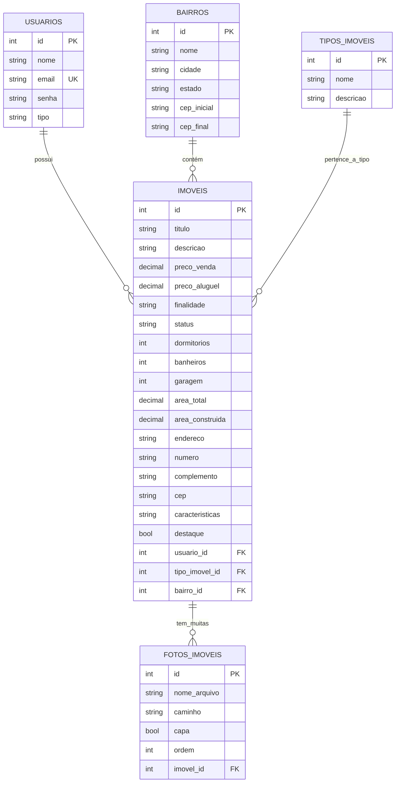

# 🏠 Sistema Imobiliário Web

Bem-vindo ao **Sistema Imobiliário Web**, uma aplicação backend desenvolvida em **Java com Spring Boot**, projetada para gerenciar **usuários, imóveis, bairros, tipos de imóveis e fotos de imóveis** de forma eficiente e segura.

## 🎯 Funcionalidades

### 👤 Gestão de Usuários
- **Cadastro de novos usuários** com criptografia de senha (BCrypt)
- **Autenticação e login seguro**
- **Listagem de todos os usuários**
- **Detalhamento de usuário específico**
- **Edição de dados cadastrais**
- **Exclusão de usuários**

### 🏠 Gestão de Imóveis
- **Cadastro de imóveis** associados a um usuário proprietário
- **Listagem de todos os imóveis**
- **Listagem de imóveis por usuário específico**
- **Listagem de imóveis por bairro específico**
- **Detalhamento de imóvel específico**
- **Edição de imóvel** (somente pelo proprietário ou administrador)
- **Exclusão de imóvel** (somente pelo proprietário ou administrador)
- **Filtros de busca** (finalidade, status, tipo, bairro, preço, etc.)

### 🏘️ Gestão de Bairros
- **Cadastro de novos bairros**
- **Listagem de todos os bairros**
- **Detalhamento de bairro específico**
- **Edição de dados do bairro**
- **Exclusão de bairro**

### 🏗️ Gestão de Tipos de Imóveis
- **Cadastro de novos tipos de imóveis** (Apartamento, Casa, Sala Comercial, etc.)
- **Listagem de todos os tipos**
- **Detalhamento de tipo específico**
- **Edição de tipo**
- **Exclusão de tipo**

### 📸 Gestão de Fotos de Imóveis
- **Upload de fotos** associadas a um imóvel
- **Listagem de fotos de um imóvel**
- **Definição de foto de capa**
- **Ordenação de fotos**
- **Edição de detalhes da foto**
- **Exclusão de foto**

### 🔐 Controle de Acesso e Segurança
- **Sessão de usuário** com `HttpSession`
- **Controle de acesso baseado em tipo de usuário** (ex: CLIENTE, CORRETOR, ADMIN)
- **Validação de propriedade** (usuário só pode editar/excluir seus próprios imóveis/fotos)
- **Criptografia de senhas** com BCrypt
- **Validação de dados de entrada**

## 🛠️ Tecnologias Utilizadas

### Backend
- **Java 21+** - Linguagem de programação principal
- **Spring Boot 3.5+** - Framework para desenvolvimento ágil
- **Spring Web** - Desenvolvimento de aplicações web e APIs REST
- **Spring Data JPA** - Mapeamento objeto-relacional (ORM)
- **Hibernate** - Implementação do JPA
- **Servlet API** - Fundação para controllers web
- **Jackson** - Serialização/desserialização JSON
- **Lombok** - Redução de código boilerplate (getters, setters, etc.)
- **BCrypt** - Criptografia de senhas
- **JSON** - Biblioteca para manipulação de JSON (alternativa ao Jackson para casos específicos)

### Banco de Dados
- **MySQL 8.0+** - Sistema de gerenciamento de banco de dados relacional

### Build e Dependências
- **Maven** - Gerenciamento de dependências e build

### Servidor de Aplicação
- **Apache Tomcat Embedded** - Servidor web embarcado no Spring Boot

### Ferramentas de Desenvolvimento
- **Eclipse IDE** - Ambiente de desenvolvimento integrado
- **Git** - Controle de versão
- **Postman** - Teste de APIs

## 📁 Estrutura do Projeto

```
imobiliaria/
├── src/
│   ├── main/
│   │   ├── java/
│   │   │   └── com/
│   │   │       └── example/
│   │   │           └── demo/
│   │   │               ├── ImobiliariaApplication.java        # Classe principal do Spring Boot
│   │   │               ├── controller/                        # Controladores REST e Web
│   │   │               │   ├── BairrosController.java
│   │   │               │   ├── ImoveisController.java
│   │   │               │   ├── TiposImoveisController.java
│   │   │               │   ├── UsuariosController.java
│   │   │               │   └── FotosImoveisController.java
│   │   │               ├── dto/                               # Data Transfer Objects
│   │   │               │   ├── BairrosDTO.java
│   │   │               │   ├── ImoveisDTO.java
│   │   │               │   ├── TiposImoveisDTO.java
│   │   │               │   ├── UsuariosDTO.java
│   │   │               │   └── FotosImoveisDTO.java
│   │   │               ├── model/                             # Entidades JPA
│   │   │               │   ├── BairrosModel.java
│   │   │               │   ├── ImoveisModel.java
│   │   │               │   ├── TiposImoveisModel.java
│   │   │               │   ├── UsuariosModel.java
│   │   │               │   └── FotosImoveisModel.java
│   │   │               ├── repository/                        # Repositórios JPA
│   │   │               │   ├── BairrosRepository.java
│   │   │               │   ├── ImoveisRepository.java
│   │   │               │   ├── TiposImoveisRepository.java
│   │   │               │   ├── UsuariosRepository.java
│   │   │               │   └── FotosImoveisRepository.java
│   │   │               ├── services/                          # Lógica de Negócio
│   │   │               │   ├── BairrosServices.java
│   │   │               │   ├── ImoveisServices.java
│   │   │               │   ├── TiposImoveisServices.java
│   │   │               │   ├── UsuariosServices.java
│   │   │               │   └── FotosImoveisServices.java
│   │   │               ├── util/                              # Classes de utilidade
│   │   │               │   └── SenhaUtil.java                 # Utilitário para criptografia de senha
│   │   │               └── config/                            # Configurações do Spring (se necessário)
│   │   │                   └── WebConfig.java
│   │   └── resources/
│   │       ├── application.properties                         # Configurações da aplicação
│   │       └── static/                                        # Arquivos estáticos (opcional)
│   │           └── uploads/                                   # Diretório para upload de arquivos
│   └── test/
│       └── java/
│           └── com/
│               └── example/
│                   └── demo/
│                       └── ImobiliariaApplicationTests.java   # Testes da aplicação
├── pom.xml                                                    # Configuração do Maven
└── README.md                                                  # Este arquivo
```

## 🚀 Como Executar o Projeto

### Pré-requisitos

- **Java JDK 21 ou superior**
- **Maven 3.6+**
- **MySQL 8.0 ou superior**
- **Git** (opcional, para clonar o repositório)

### 1. Clonar o Repositório (se aplicável)

```bash
git clone https://github.com/seu-usuario/imobiliaria.git
cd imobiliaria
```

### 2. Configurar o Banco de Dados

1.  **Acesse o MySQL:**
    ```bash
    mysql -u root -p
    ```

2.  **Crie o banco de dados:**
    ```sql
    CREATE DATABASE imobiliaria CHARACTER SET utf8mb4 COLLATE utf8mb4_unicode_ci;
    ```

3.  **Saia do MySQL:**
    ```sql
    exit
    ```

4.  **(Opcional) Configure o `application.properties`:**
    Edite o arquivo `src/main/resources/application.properties` para corresponder às suas configurações de banco de dados.

    ```properties
    # application.properties

    # --- Dados de Conexão com o Banco de Dados ---
    spring.datasource.url=jdbc:mysql://localhost:3306/imbiliaria?useTimezone=true&serverTimezone=UTC&allowPublicKeyRetrieval=true&useSSL=false
    spring.datasource.username=seu_usuario_mysql
    spring.datasource.password=sua_senha_mysql
    spring.datasource.driver-class-name=com.mysql.cj.jdbc.Driver

    # --- Configurações do JPA / Hibernate ---
    spring.jpa.hibernate.ddl-auto=update # CUIDADO: 'create' apaga dados existentes!
    spring.jpa.show-sql=true
    spring.jpa.properties.hibernate.dialect=org.hibernate.dialect.MySQL8Dialect
    spring.jpa.properties.hibernate.format_sql=true

    # --- Configurações do Servidor ---
    server.port=8080

    # --- Configurações do Upload de Arquivos ---
    app.upload.dir=./uploads # Caminho relativo para uploads
    # app.upload.dir=/caminho/completo/para/uploads # Caminho absoluto (ex: Linux)
    ```

    *   **Substitua `seu_usuario_mysql` e `sua_senha_mysql`** pelas suas credenciais reais.
    *   **`spring.jpa.hibernate.ddl-auto=update`** é seguro para desenvolvimento, pois atualiza o schema sem apagar dados. Para produção, evite `create` ou `create-drop`.

### 3. Executar via Maven

No terminal, dentro da pasta do projeto (`imobiliaria`):

```bash
./mvnw spring-boot:run
```

*(No Windows, use `mvnw.cmd spring-boot:run`)*

O servidor iniciará na porta `8080`.

---

## 🌐 Endpoints da API REST

### Autenticação

*   **`POST /login`**: Realiza login e inicia sessão.
*   **`POST /logout`**: Encerra a sessão.

### Usuários (`/usuarios`)

*   **`GET /usuarios`**: Listar todos os usuários (excluindo senhas).
*   **`GET /usuarios/{id}`**: Buscar usuário por ID (excluindo senha).
*   **`POST /usuarios`**: Criar novo usuário (senha é criptografada automaticamente).
*   **`PUT /usuarios/{id}`**: Atualizar dados do usuário (excluindo senha).
*   **`DELETE /usuarios/{id}`**: Excluir usuário.

### Imóveis (`/imoveis`)

*   **`GET /imoveis`**: Listar todos os imóveis.
*   **`GET /imoveis/{id}`**: Buscar imóvel por ID.
*   **`GET /imoveis/usuario/{id}`**: Listar imóveis de um usuário específico.
*   **`GET /imoveis/bairro/{id}`**: Listar imóveis de um bairro específico.
*   **`POST /imoveis`**: Criar novo imóvel (usuário logado necessário).
*   **`PUT /imoveis/{id}`**: Atualizar imóvel (usuário logado deve ser o proprietário).
*   **`DELETE /imoveis/{id}`**: Excluir imóvel (usuário logado deve ser o proprietário).

### Bairros (`/bairros`)

*   **`GET /bairros`**: Listar todos os bairros.
*   **`GET /bairros/{id}`**: Buscar bairro por ID.
*   **`POST /bairros`**: Criar novo bairro.
*   **`PUT /bairros/{id}`**: Atualizar bairro.
*   **`DELETE /bairros/{id}`**: Excluir bairro.

### Tipos de Imóveis (`/tipos-imoveis`)

*   **`GET /tipos-imoveis`**: Listar todos os tipos.
*   **`GET /tipos-imoveis/{id}`**: Buscar tipo por ID.
*   **`POST /tipos-imoveis`**: Criar novo tipo.
*   **`PUT /tipos-imoveis/{id}`**: Atualizar tipo.
*   **`DELETE /tipos-imoveis/{id}`**: Excluir tipo.

### Fotos de Imóveis (`/fotos-imoveis`)

*   **`GET /fotos-imoveis/imovel/{id}`**: Listar fotos de um imóvel específico.
*   **`POST /fotos-imoveis`** (consumindo `multipart/form-data`): Fazer upload de uma nova foto para um imóvel.
*   **`PUT /fotos-imoveis/{id}`**: Atualizar detalhes da foto (capa, ordem, descrição).
*   **`DELETE /fotos-imoveis/{id}`**: Excluir foto.

---

## 📦 Dependências Principais (pom.xml)

```xml
<dependencies>
    <!-- Spring Boot Starter Web (Servlet, Tomcat, Spring MVC, RestControllers) -->
    <dependency>
        <groupId>org.springframework.boot</groupId>
        <artifactId>spring-boot-starter-web</artifactId>
    </dependency>

    <!-- Spring Boot Starter Data JPA (Hibernate, Transações, etc.) -->
    <dependency>
        <groupId>org.springframework.boot</groupId>
        <artifactId>spring-boot-starter-data-jpa</artifactId>
    </dependency>

    <!-- Driver JDBC do MySQL -->
    <dependency>
        <groupId>com.mysql</groupId>
        <artifactId>mysql-connector-j</artifactId>
        <scope>runtime</scope>
    </dependency>

    <!-- Lombok (Getters, Setters, Construtores, etc.) -->
    <dependency>
        <groupId>org.projectlombok</groupId>
        <artifactId>lombok</artifactId>
        <optional>true</optional>
    </dependency>

    <!-- Biblioteca para Criptografia de Senha (BCrypt) -->
    <dependency>
        <groupId>org.mindrot</groupId>
        <artifactId>jbcrypt</artifactId>
        <version>0.4</version>
    </dependency>

    <!-- Biblioteca para Manipulação de JSON (opcional, se não quiser usar Jackson diretamente) -->
    <dependency>
        <groupId>org.json</groupId>
        <artifactId>json</artifactId>
        <version>20250517</version>
    </dependency>

    <!-- Spring Boot Starter Test (para testes unitários/integração) -->
    <dependency>
        <groupId>org.springframework.boot</groupId>
        <artifactId>spring-boot-starter-test</artifactId>
        <scope>test</scope>
    </dependency>

    <!-- Spring Boot DevTools (reinício automático durante desenvolvimento) -->
    <dependency>
        <groupId>org.springframework.boot</groupId>
        <artifactId>spring-boot-devtools</artifactId>
        <scope>runtime</scope>
        <optional>true</optional>
    </dependency>
</dependencies>
```

---

## 🏗️ Arquitetura do Sistema

O sistema segue o padrão **Model-View-Controller (MVC)** com foco em **API RESTful**.

### Camadas

1.  **Controller (`@RestController`)**:
    *   Recebe requisições HTTP.
    *   Valida entrada (parâmetros, corpo da requisição).
    *   Chama o `Service` apropriado.
    *   Retorna respostas HTTP (JSON).

2.  **Service (`@Service`)**:
    *   Contém a **lógica de negócio**.
    *   Interage com os `Repository`.
    *   Manipula dados (validações de regra de negócio, criptografia de senha, etc.).
    *   Retorna modelos ou DTOs.

3.  **Repository (`@Repository` / `JpaRepository`)**:
    *   Interface que define operações de acesso ao banco de dados.
    *   Usa anotações JPA (`@Query`, `@Modifying`, etc.) ou métodos padrão do `JpaRepository`.

4.  **Model (`@Entity`)**:
    *   Representa as **entidades do banco de dados**.
    *   Mapeada com anotações JPA (`@Table`, `@Column`, `@OneToMany`, etc.).

5.  **DTO (Data Transfer Object)**:
    *   Objetos simples usados para **transferir dados** entre camadas (especialmente entre Controller e Service/View).
    *   **Evita exposição direta das entidades JPA**, aumentando segurança e desacoplamento.

### Padrão de Projeto

*   **Injeção de Dependência (DI)**: O Spring gerencia e injeta as dependências (`@Autowired`).
*   **Anotações Spring**: `@RestController`, `@Service`, `@Repository`, `@Entity`, `@Table`, etc., são usadas para configurar e vincular componentes automaticamente.
*   **Separation of Concerns**: Cada camada tem responsabilidades bem definidas.

---

## 📊 Diagrama de Entidades (Básico)



---

## 🚨 Tratamento de Erros

O sistema implementa tratamento de erros em diferentes níveis:

1.  **Controller Advice (Global Handler)**: Pode ser implementado para capturar exceções globais e retornar respostas padronizadas.
2.  **Try-Catch Local**: Usado em operações sensíveis (ex: upload de arquivos) para retornar mensagens específicas de erro.
3.  **Validação de Entrada**: Usando `@Valid` e anotações do `javax.validation` (ou `jakarta.validation`) nos DTOs/models recebidos via `@RequestBody`.
4.  **Checagem de Existentes**: Antes de atualizar ou excluir, o sistema verifica se o recurso existe no banco.
5.  **Controle de Acesso**: Verificações de sessão e propriedade (ex: somente o proprietário pode editar/excluir seu imóvel) são feitas no Service ou Controller.

---

## 📈 Próximas Melhorias

*   **Paginação e Filtragem Avançada**: Implementar `Pageable` e `@Query` para consultas mais eficientes e personalizadas.
*   **Autenticação com JWT**: Substituir o sistema de sessão por tokens JWT para maior escalabilidade e statelessness.
*   **Autorização com Spring Security**: Implementar `@PreAuthorize` e `@PostAuthorize` para controle de acesso mais refinado.
*   **Validação de Dados Mais Robusta**: Criar validadores personalizados (`@Constraint`).
*   **Upload de Múltiplas Fotos**: Permitir upload de várias fotos de uma vez.
*   **Compressão de Imagens**: Otimizar imagens após upload para economizar espaço e banda.
*   **Cache**: Implementar cache para dados frequentemente acessados (ex: bairros, tipos de imóveis).
*   **Testes Unitários e de Integração**: Aumentar a cobertura de testes com JUnit e Mockito.
*   **Documentação da API com OpenAPI/Swagger**: Facilitar a integração e o consumo da API.
*   **Internacionalização (i18n)**: Suporte a múltiplos idiomas.
*   **Auditoria de Dados**: Registrar quem criou/atualizou/excluiu registros e quando.
*   **Geração de Relatórios**: Permitir exportar dados (imóveis, usuários) para PDF ou Excel.
*   **Integração com Mapas**: Exibir localização dos imóveis em um mapa (Google Maps, OpenStreetMap).
*   **Sistema de Favoritos**: Permitir que usuários marquem imóveis como favoritos.
*   **Sistema de Mensagens**: Comunicação entre proprietário do imóvel e interessados.
*   **Sistema de Avaliações/Comentários**: Permitir avaliações e comentários sobre imóveis.

---

## 🤝 Contribuições

Contribuições são bem-vindas! Sinta-se à vontade para abrir *issues* para reportar bugs ou solicitar recursos, ou enviar *pull requests* com melhorias.

---

## © Licença

Este projeto é de código aberto e está licenciado sob a [MIT License](https://opensource.org/licenses/MIT).

---

## 🙏 Agradecimentos

*   Aos desenvolvedores do **Spring Framework** e **Spring Boot**.
*   À comunidade **Java** e **MySQL**.
*   Às ferramentas **Lombok** e **BCrypt**.
*   À sua criatividade e persistência em aprender e desenvolver! 😊

---

**Observação:** Este README foi gerado com base na estrutura e funcionalidades descritas nas conversas anteriores com o agente Qwen3-Coder. Pode haver variações menores dependendo da implementação exata de cada classe e método.
